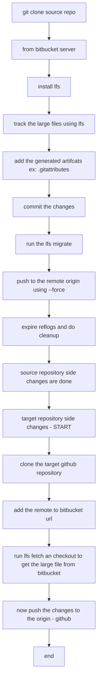

# LFS Flows



## Shell script for this
```Shell
#!/bin/sh
cd migration-test-repo
git lfs install
git lfs track "*.zip"
git add .gitattributes
git add .
git commit -m "Track large files with Git LFS"
git lfs migrate import --include="*.zip"
git push origin --force
git reflog expire --expire-unreachable=now --all
git gc --prune=now --aggressive
git push
```
